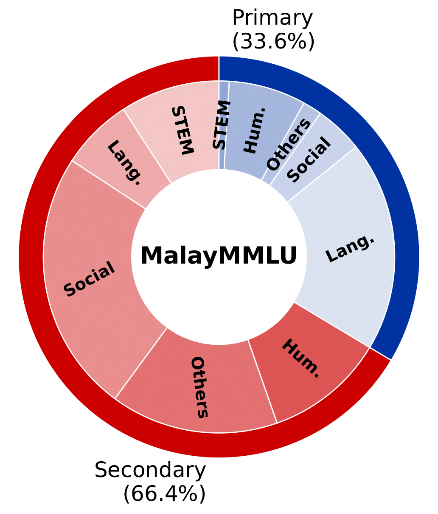

# MalayMMLU: A Multitask Benchmark for the Low-Resource Malay Language (Laman Rasmi)

Dilancarkan pada 27 September 2024

<h4 align="center">
    <p>
        <a href="https://github.com/YTLAILabs/MalayMMLU/">English</a> |
        <b href="https://github.com/YTLAILabs/MalayMMLU/blob/main/README_ms.md">Bahasa Melayu</b> 
    <p>
        <p align="center" style="display: flex; flex-direction: row; justify-content: center; align-items: center">
        📄 <a href="https://openreview.net/pdf?id=VAXwQqkp5e" target="_blank" style="margin-right: 15px; margin-left: 10px">Paper</a> • 
        🤗 <a href="https://huggingface.co/collections/ytlailabs2024/malaymmlu-66567e2c1ee98abe52bf955d" target="_blank" style="margin-left: 10px">Dataset</a> 
        </p>
</h4>

# Pengenalan

MalayMMLU ialah penanda aras kefahaman bahasa multitugas (MLU) yang pertama untuk Bahasa Melayu. Penanda aras ini merangkumi 24,213 soalan yang meliputi peringkat pendidikan rendah (Tahun 1-6) dan menengah (Tingkatan 1-5) di Malaysia, yang terdiri daripada 5 topik utama yang terbahagi kepada 22 subjek.

<p align="center">

</p>

| **Topik**   | **Subjek**                                                                                                                                                                                                                                                                                                                                                                                 |
|----------------|---------------------------------------------------------------------------------------------------------------------------------------------------------------------------------------------------------------------------------------------------------------------------------------------------------------------------------------------------------------------------------------------|
| **STEM**       | Computer Science (Menengah), Biology (Menengah), Chemistry (Menengah), Computer Literacy (Menengah), Mathematics (Rendah, Menengah), Additional Mathematics (Menengah), Design and Technology (Rendah, Menengah), Core Science (Rendah, Menengah), Information and Communication Technology (Rendah), Automotive Technology (Menengah) |
| **Bahasa**   | Bahasa Melayu (Rendah, Menengah)                                                                                                                                                                                                                                                                                                                                                          |
| **Sains Sosial** | Geografi (Menengah), Kajian Tempatan (Rendah), Sejarah (Rendah, Menengah)                                                                                                                                                                                                                                                                                                               |
| **Lain-lain**     | Kemahiran Hidup (Rendah, Menengah), Prinsip Perakaunan (Menengah), Ekonomi (Menengah), Business (Menengah), Agriculture (Menengah)                                                                                                                                                                                                                                                  |
| **Kemanusiaan** | Quran and Sunnah (Menengah), Islam (Rendah, Menengah), Sports Science Knowledge (Menengah)                                                                                                                                                                                                                                                                                                 |

# Keputusan

### Keputusan Penilaian Zero-shot untuk MalayMMLU (Ketepatan token pertama)

| **Model**               | **Bahasa** | **Kemanusiaan** | **STEM** | **Sains Sosial** | **Lain-lain** | **Purata** |
|-------------------------|-------------------|---------------------|---------------|-------------------------|-----------------|------------------|
| Random                  | 38.01             | 42.09               | 36.31         | 36.01                   | 38.07           | 38.02            |
| GPT-4                   | **82.90**         | **83.91**           | **78.80**     | **77.29**               | **77.33**       | **80.11**        |
| GPT-3.5                 | 69.62             | 71.01             | 67.17       | 66.70                 | 63.73         | 67.78          |
| [LLaMA-3 (8B)](https://huggingface.co/meta-llama/Meta-Llama-3-8B-Instruct)            | 63.93             | 66.21               | 62.26         | 62.97                   | 61.38           | 63.46            |
| [LLaMA-2 (13B)](https://huggingface.co/meta-llama/Llama-2-13b-chat-hf)           | 45.58             | 50.72               | 44.13         | 44.55                   | 40.87           | 45.26            |
| [LLaMA-2 (7B)](https://huggingface.co/meta-llama/Llama-2-7b-chat-hf)           | 47.47             | 52.74               | 48.71         | 50.72                   | 48.19           | 49.61            |
| [Mistral-v0.3 (7B)](https://huggingface.co/mistralai/Mistral-7B-Instruct-v0.3)       | 56.97             | 59.29               | 57.14         | 58.28                   | 56.56           | 57.71            |
| [Mistral-v0.2 (7B)](https://huggingface.co/mistralai/Mistral-7B-Instruct-v0.2)       | 56.23             | 59.86               | 57.10         | 56.65                   | 55.22           | 56.92            |
| [Sailor (7B)](https://huggingface.co/sail/Sailor-7B-Chat)   | 74.54           | 68.62               | 62.79         | 64.69                   | 63.61           | 67.58            |
| [SeaLLM-v2.5 (7B)](https://huggingface.co/SeaLLMs/SeaLLM-7B-v2.5)   | 69.75             | 67.94               | 65.29         | 62.66                   | 63.61           | 65.89            |
| [Phi-3 (14B)](https://huggingface.co/microsoft/Phi-3-medium-4k-instruct)             | 60.07             | 58.89               | 60.91         | 58.73                   | 55.24           | 58.72            |
| [Phi-3 (3.8B)](https://huggingface.co/microsoft/Phi-3-mini-4k-instruct)            | 52.24             | 55.52               | 54.81         | 53.70                   | 51.74           | 53.43            |
| [GLM-4 (9B)](https://huggingface.co/THUDM/glm-4-9b-chat)              | 58.51             | 60.48               | 56.32         | 55.04                   | 53.97           | 56.87            |
| [Qwen-1.5 (7B)](https://huggingface.co/Qwen/Qwen1.5-7B-Chat)           | 60.13             | 59.14               | 58.62         | 54.26                   | 54.67           | 57.18            |
| [Qwen-1.5 (4B)](https://huggingface.co/Qwen/Qwen1.5-4B-Chat)           | 48.39             | 52.01               | 51.37         | 50.00                   | 49.10           | 49.93            |
| [Qwen-1.5 (1.8B)](https://huggingface.co/Qwen/Qwen1.5-1.8B-Chat)         | 42.70             | 43.37               | 43.68         | 43.12                   | 44.42           | 43.34            |
| [Gemma (7B)](https://huggingface.co/google/gemma-7b-it)              | 45.53             | 50.92               | 46.13         | 47.33                   | 46.27           | 47.21            |
| [Gemma (2B)](https://huggingface.co/google/gemma-2b-it)              | 46.50             | 51.15               | 49.20         | 48.06                   | 48.79           | 48.46            |
| [Baichuan-2 (7B)](https://huggingface.co/baichuan-inc/Baichuan2-7B-Chat)         | 40.41             | 47.35               | 44.37         | 46.33                   | 43.54           | 44.30            |
| [Komodo (7B)](https://huggingface.co/Yellow-AI-NLP/komodo-7b-base)   | 43.62             | 45.53               | 39.34         | 39.75                   | 39.48           | 41.72            |
| [MaLLaM-v2 (5B)](https://huggingface.co/mesolitica/mallam-5b-20k-instructions-v2)| 42.56             | 46.42               | 42.16         | 40.81                   | 38.81           | 42.07            |

### Keputusan Penilaian Few-shot untuk MalayMMLU (Ketepatan token pertama)
<p align="center">

</p>

# Pemasangan

```
git clone https://github.com/YTLAILabs/MalayMMLU
cd MalayMMLU
pip install -r requirements.txt
```
# Penilaian
* <code>SHOT</code> : 0, 1, 2 atau 3
* <code>--by_letter</code> flag untuk penilaian token pertama
* <code>MODEL</code>: LLM's HuggingFace repo id seperti <code>meta-llama/Meta-Llama-3-8B-Instruct</code>
* <code>PRED_FILE</code>: nama fail ramalan
### Penilaian berdasarkan ketepatan token pertama
```
# prediction
python src/evaluate.py  --by_letter --shot $SHOT --use_chat_template True  --task=MalayMMLU \
                    --base_model=$MODEL  \
                    --output_folder=output/ --token $TOKEN

# calculate accuracy
python src/calculate_accuracies.py --pred_files $PRED_FILE \
    --data_file=$SHOT \
    --output_dir=output/
```
### Penilaian berdasarkan ketepatan jawapan penuh
```
python src/evaluate.py  --shot $SHOT --use_chat_template True  --task=MalayMMLU \
                    --base_model=$MODEL  \
                    --output_folder=output/ --token $TOKEN

python src/calculate_accuracies.py --pred_files $PRED_FILE \
    --data_file=$SHOT \
    --output_dir=output/

```

### Penilaian untuk GPT

* <code>API_KEY</code>: OpenAI API key
```
# prediction
python src/evaluate_gpt.py --model gpt-3.5-turbo --api_key $API_KEY --shot $SHOT
```
Muat turun fail ramalan dari [OpenAI platform](https://platform.openai.com/batches)
```
# calculate accurcacy
python src/calculate_accuracies.py --pred_files $PRED_FILE \
    --data_file=$SHOT \
    --output_dir=output/
```

## Petikan

```bibtex
@InProceedings{MalayMMLU2024,
    author    = {Poh, Soon Chang and Yang, Sze Jue and Tan, Jeraelyn Ming Li and  Chieng, Lawrence Leroy Tze Yao and Tan, Jia Xuan and Yu, Zhenyu and Foong, Chee Mun and Chan, Chee Seng },
    title     = {MalayMMLU: A Multitask Benchmark for the Low-Resource Malay Language},
    booktitle = {Empirical Methods in Natural Language Processing (EMNLP)},
    month     = {November},
    year      = {2024},
}
```

# Penghargaan

Kod ini dibina atas [IndoMMLU](https://github.com/fajri91/IndoMMLU)
